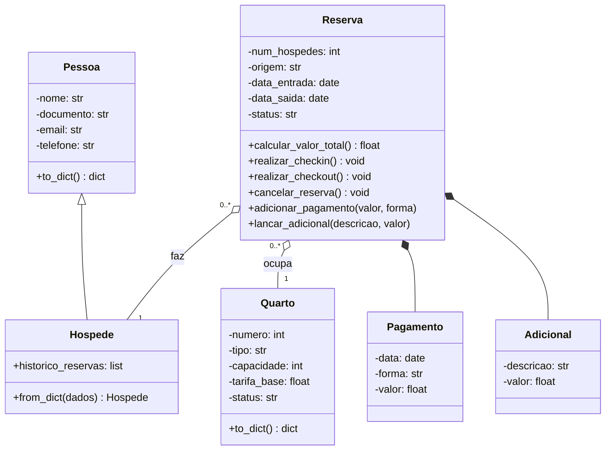

# 🏨 Roomex - Sistema de Gestão Hoteleira

Sistema de linha de comando (CLI) para gerenciamento de reservas de hotel, desenvolvido como Projeto Final da disciplina de Programação Orientada a Objetos (POO) do curso de Engenharia de Software da Universidade Federal do Cariri (UFCA).

## 🎯 Objetivo
O projeto visa aplicar os pilares da Orientação a Objetos (Herança, Polimorfismo, Encapsulamento e Abstração) em um cenário real. O sistema gerencia o ciclo de vida de uma hospedagem, desde a reserva até o checkout, aplicando regras de negócio financeiras e gerando indicadores de desempenho.

---

## 🚀 Funcionalidades (Versão 1.0)

### 1. Gestão de Reservas
* **Ciclo de Vida Completo:** Criação (`PENDENTE`), Confirmação, Check-in (`ATIVA`), Check-out (`FINALIZADA`) e Cancelamento (`CANCELADA`).
* **Validações:** Impede conflitos de datas (overbooking) e check-in fora do prazo.

### 2. Motor de Preços Dinâmico
* **Temporadas:** Cálculo automático de tarifas diferenciadas para Alta Temporada (configurável via `settings.json`).
* **Fim de Semana:** Aplicação automática de multiplicador para diárias de Sábado e Domingo.

### 3. Financeiro
* **Controle de Contas:** Registro de pagamentos parciais ou totais.
* **Consumo:** Lançamento de itens adicionais (frigobar, lavanderia, etc.).
* **Regras de Bloqueio:** O sistema impede o check-out se houver saldo devedor.
* **Multas:** Aplicação automática de multa em cancelamentos tardios.

### 4. Relatórios Gerenciais (KPIs)
O sistema gera métricas hoteleiras essenciais:
* **Taxa de Ocupação (%):** Percentual de quartos ocupados no período.
* **ADR (Diária Média):** Valor médio pago por diária vendida.
* **RevPAR:** Receita gerada por quarto disponível.
* **Relatório de Perdas:** Monitoramento de Cancelamentos e No-Show.

---

## 📦 Instalação e Execução

### Pré-requisitos
* Python 3.8 ou superior.

### Passo a Passo

1.  **Clone o repositório:**
    ```bash
    git clone https://github.com/Angelo-Gabriel-Dev/Roomex
    cd Roomex
    ```

2.  **Popule o Banco de Dados (Seed):**
    Antes de rodar pela primeira vez, execute o script para criar os quartos e configurações iniciais.
    ```bash
    py -m roomex.seed
    ```

3.  **Inicie o Sistema:**
    ```bash
    py -m roomex.main
    ```

---

## 🧪 Como Rodar os Testes

O projeto utiliza o framework `pytest` para garantir a integridade das regras de negócio (cálculo de preços, fluxos de status e relatórios).

1.  **Instale a dependência de testes:**
    ```bash
    pip install pytest
    ```

2.  **Execute a bateria de testes:**
    ```bash
    py -m pytest
    ```

> **Resultado esperado:** 100% dos testes passando (Passed).

---

## ⚙️ Configurações (settings.json)

Você pode alterar as regras de negócio editando o arquivo `settings.json` na raiz do projeto:

* **multiplicador_fim_de_semana:** Fator de aumento para sáb/dom (ex: `1.2`).
* **multa_cancelamento:** Valor fixo da multa (ex: `150.00`).
* **temporadas:** Lista de períodos de alta estação com seus multiplicadores.

---

## 🏛️ Diagrama de Classes (UML)

Estrutura final das classes do sistema:


---

## 👨‍💻 Créditos

* **Desenvolvido por:** Ângelo Gabriel
* **Disciplina:** Programação Orientada a Objetos (POO)
* **Universidade:** Universidade Federal do Cariri (UFCA)
* **Versão:** 1.0 (Final)
